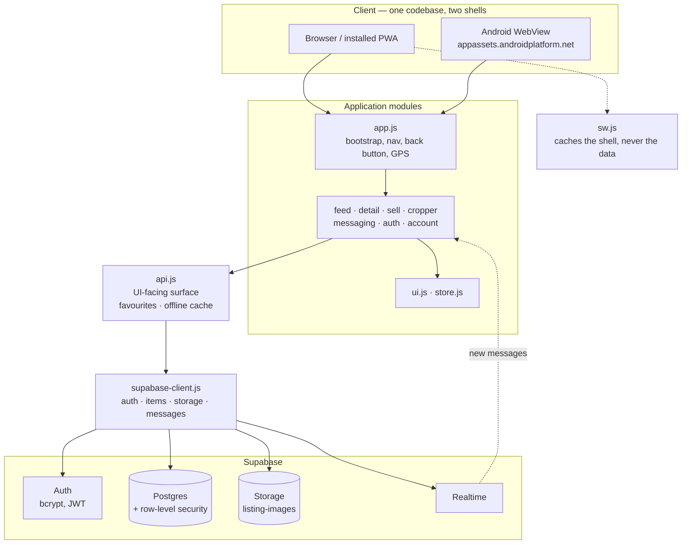

# Architecture

## The shape of it

## The layers, and why they are separate

**`config.js`** — where the backend lives. Reads a device override from
`localStorage` first, so the Account panel can point the app at a different
Supabase project without editing code.

**`supabase-client.js`** — the only file that knows Supabase exists. Everything
above it deals in plain objects with camelCase keys; the snake_case rows and
the PostgREST error codes stop here.

**`api.js`** — what the UI actually calls. It delegates anything needing a
server downward and keeps three genuinely device-local things: which listings
you saved, which email you last signed in with, and a small read-through cache
of listing metadata so browsing survives a dropped connection.

**Feature modules** — one per surface, each owning its own DOM and its own
event wiring. They talk to `api.js` and to `store.js`, never to each other.
Where two features have to cooperate — the detail view opening the edit form,
the inbox opening a listing — `app.js` passes a callback in at startup rather
than the modules importing one another. That keeps the import graph a tree and
avoids circular imports.

**`store.js`** — filters and view state, with a subscribe hook. Small on
purpose: identity is deliberately *not* here, because a cached copy of "who is
signed in" is exactly the kind of thing that drifts from the truth. That always
comes from `api.getCurrentUser()`, which is backed by the verified session.

## Decisions worth explaining

### Permission is a database concern

The UI hides the delete button on someone else's listing, but that is a
courtesy. The rule that matters is the RLS policy, and it is checked on every
request regardless of what the browser sends. This is the single biggest change
from the previous version, where ownership was an array in `localStorage` and
the database let anyone edit anything.

A useful consequence: `deleteItem` checks the returned row count and raises
when it is zero. With RLS on and no matching policy, PostgREST reports success
having changed nothing — so "no error" is not the same as "it worked".

### One messages table, addressed by channel

Three conversation types share a table because they share a shape. The
alternative — a table each — would have meant three sets of policies, three
Realtime subscriptions and three near-identical render paths. See
[DATA-MODEL.md](DATA-MODEL.md) for how `channel_id` is built.

### Realtime for open conversations, polling for the badge

An open thread subscribes to Realtime, filtered to its own `channel_id`, and
unsubscribes when the modal closes. The unread badge does *not* hold a
subscription per conversation — a user has one per counterparty, so that would
grow without bound. It refreshes when the window regains focus and on a slow
interval instead.

### Images go to Storage

Photos are resized and re-encoded in a canvas before upload, then stored as
files. What the database holds is a URL. This replaced base64 data URLs in a
`text` column, which were also mirrored into `localStorage` on every feed load
and blew the quota after a handful of listings.

### The service worker never caches data

The shell is cached network-first with a cache fallback. Listing photos are
cache-first with a background refresh, capped at 60 entries. Anything under
`/rest/v1/`, `/auth/v1/` or `/realtime/` is left alone entirely — a stale
listing or a stale chat message is worse than no listing at all.

### The Android shell is thin

`MainActivity` loads the same assets over a real HTTPS origin via
`WebViewAssetLoader`, so service workers and modern web APIs behave as in a
browser. It handles three things the web cannot: the file picker with runtime
permissions, hardware back, and moving the task to the background.

Hardware back calls `window.handleAndroidBackButton()` and only exits when it
returns `false`, so back peels off one layer at a time — cropper, zoom, chat,
sell, detail, tab, filters — instead of leaving the app from the first press.

The only JavaScript interface exposed is `AndroidBridge.moveToBackground()`,
which takes no arguments and carries no data.

## Where things would strain

- **Search is `ilike` across three columns.** Fine at hundreds of listings.
  Past that it wants a `tsvector` column and a GIN index.
- **The inbox fetches 300 recent messages and groups them client-side.** A
  `conversations` view, or a table with a `last_message_at`, would scale better.
- **`purge_expired_sold_items()` runs when someone opens the app.** With nobody
  using it, sold listings linger. `pg_cron` fixes that; the schema has the line
  ready to uncomment.
- **Reports have no admin surface.** They are written and never read by the app.
