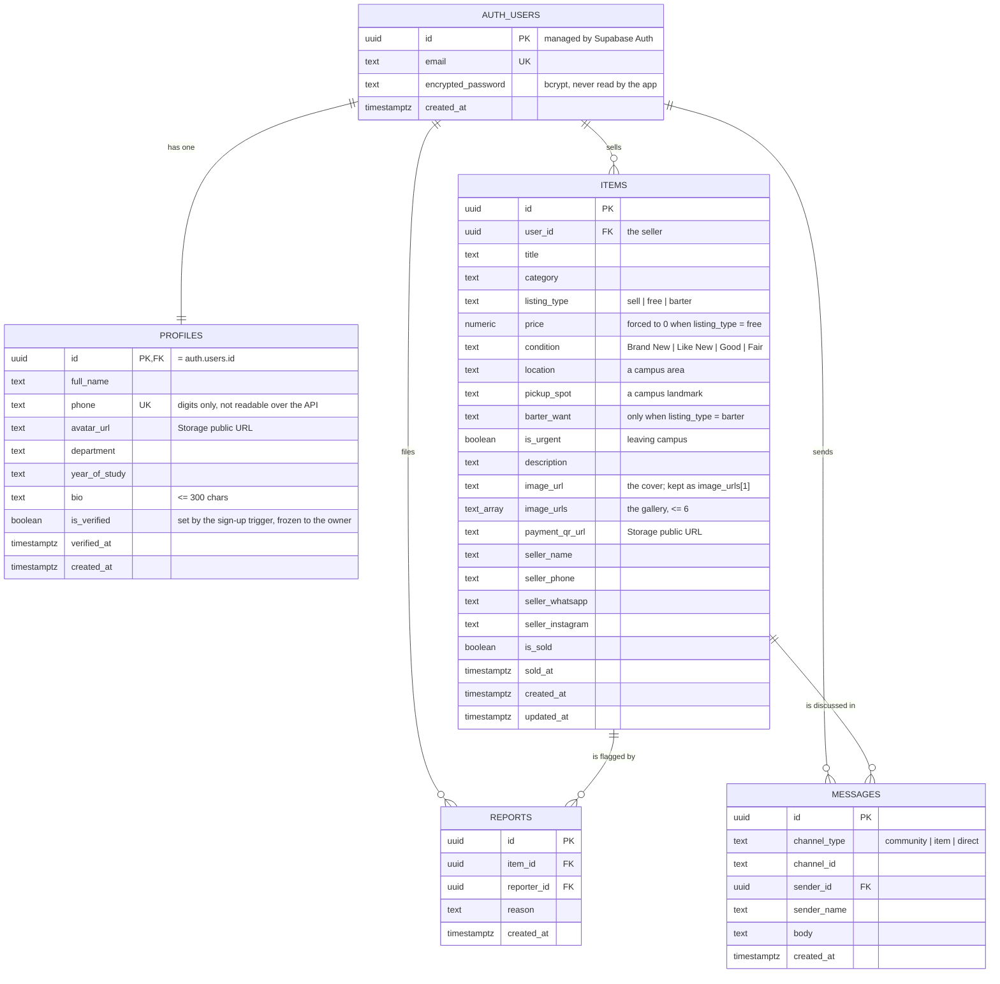

# Data model

Eight tables plus one storage bucket. Identity lives in `auth.users`, which
Supabase owns — this project never writes to it directly and never sees a
password.

`campus_settings` is the odd one out: a single row, read-only over the API,
holding which email domains count as proof of being a student. It sits outside
the diagram below because nothing references it by key — the sign-up trigger
reads it, and everything else reads the `is_verified` flag it produced.

## Entity relationships

## How one messages table serves three conversations

`channel_type` and `channel_id` together address a conversation. This keeps a
single table, a single Realtime subscription shape, and one set of policies.

| Conversation | `channel_type` | `channel_id` | Who can read it |
|---|---|---|---|
| Community room | `community` | `community` | anyone signed in |
| Buyer ↔ seller about a listing | `item` | `<itemId>:<buyerId>` | that buyer, and the seller of that item |
| Private one-to-one | `direct` | the two user ids sorted and joined with `:` | those two people |

Sorting the two ids for a direct channel matters: both sides have to derive the
same string or they end up in separate conversations that never meet. There is
a test for exactly that in `tests/api.test.mjs`.

## Row-level security at a glance

| Table | Select | Insert | Update | Delete |
|---|---|---|---|---|
| `profiles` | anyone, minus `phone` | trigger only | own row, minus `is_verified` | — |
| `campus_settings` | anyone | — | — | — |
| `items` | anyone | `auth.uid() = user_id` **and verified** | owner | owner |
| `requests` | anyone | `auth.uid() = user_id` **and verified** | owner | owner |
| `reviews` | anyone | author, and only about someone you have messaged | author | author |
| `messages` | your conversations | as yourself | — | — |
| `reports` | your own | as yourself | — | — |
| `payments` | both parties | buyer, against a real listing | seller only | — |
| `storage.objects` | anyone | own folder | own folder | own folder |

A blank cell means no policy exists, and with RLS enabled that means the
operation is denied for everyone using the API.

Two of those rules are not policies at all, because RLS works on rows and both
are shaped differently:

- **`profiles.phone` is excluded by a column grant.** The select policy is
  `using (true)` — a seller's name, photo, course and badge are as public as
  the listing they posted — and the `grant select (…)` next to it names every
  column the API may read. `phone` is not one of them. The app never needs it
  from here: it reads the signed-in user's own number from their session, and
  `email_for_phone()` resolves a phone to an email as a `SECURITY DEFINER`
  function without exposing the table.
- **`profiles.is_verified` is frozen by a trigger.** The update policy has to
  let the owner write their own row, which on its own would let any account
  mark itself a verified student in one request. The trigger refuses the change
  when `auth.uid()` is the row's own id — which still leaves it settable from
  the SQL editor, where `auth.uid()` is null.

Browsing is deliberately open — you should be able to see what is for sale
before making an account. Contact details are hidden in the UI until you sign
in, which is a product decision rather than a security boundary; anything the
row contains is readable by anyone who queries the table. Keep that in mind
before adding a genuinely sensitive column to `items`.

## Constraints worth knowing

- `sold_at_matches_is_sold` — an item is either unsold with no `sold_at`, or
  sold with one. It cannot be half-way, which is what the 5-hour purge relies on.
- `title` is 3–120 characters, `description` at most 2000, `body` 1–2000.
- `price` cannot be negative.
- `condition` is constrained to the four values the UI offers.
- `reports` is unique on `(item_id, reporter_id)` — one report per person per
  listing, which the client surfaces as "you have already reported this".
- `items_free_costs_nothing` — a listing in `free` mode must be priced at zero.
  The mode is the source of truth; the price follows it, in both the client and
  the database, so the two can never disagree about whether something is a
  giveaway.
- `items_listing_type_valid` — `sell`, `free` or `barter`, nothing else.
- `items_gallery_size` — at most 6 photos, matching
  `PRConfig.MAX_PHOTOS_PER_ITEM`.
- `items.barter_want` is at most 200 characters, `profiles.bio` at most 300.

## Images

Photos go to the `listing-images` bucket, under `<user-id>/<kind>-<timestamp>-<random>.<ext>`.
The bucket is public to read, capped at 5MB per file and limited to JPEG, PNG
and WEBP. The write policy checks that the first path segment equals
`auth.uid()`, so nobody can upload into anyone else's folder.

The database stores the resulting URL. It does not store image bytes — an
earlier version put base64 data URLs in a `text` column and mirrored them into
`localStorage`, which exhausted the browser quota after a handful of listings.

A listing keeps its whole gallery in `image_urls` and repeats the first entry
in `image_url`. The duplication is on purpose: `image_url` is what an older
build, a cached feed page, or anything else written before the gallery existed
reads, and keeping it in step means none of them break. Deleting a listing
removes every photo in the gallery, not just the cover.

Profile photos share the same bucket under the `avatar` kind. They are shrunk
to 512px on the way in rather than the 1400px a listing photo gets, because
they are drawn at 44px in a chat row.
