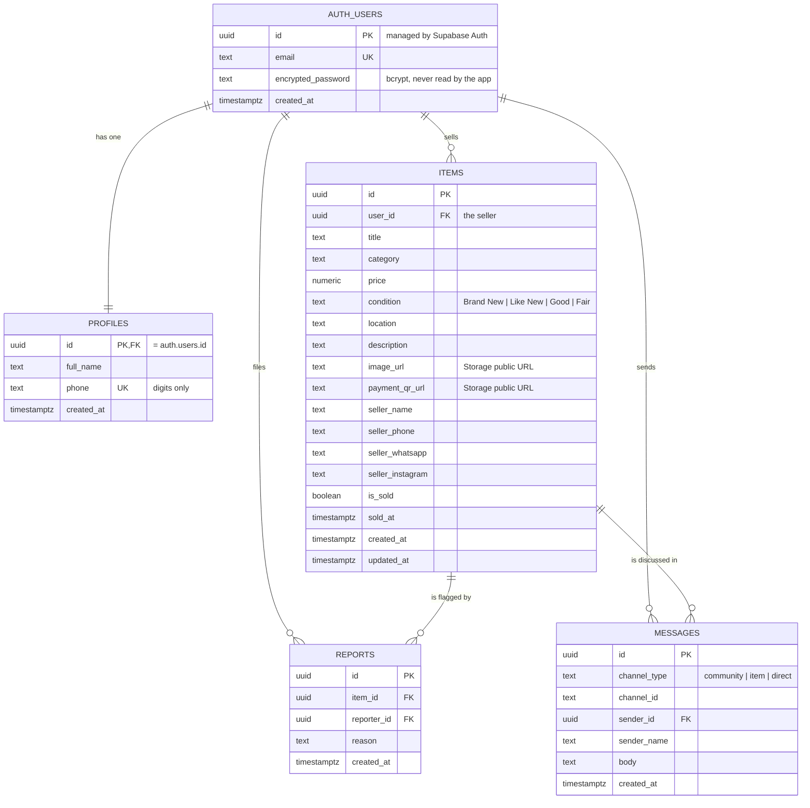

# Data model

Five tables plus one storage bucket. Identity lives in `auth.users`, which
Supabase owns — this project never writes to it directly and never sees a
password.

## Entity relationships

## How one messages table serves three conversations

`channel_type` and `channel_id` together address a conversation. This keeps a
single table, a single Realtime subscription shape, and one set of policies.

| Conversation | `channel_type` | `channel_id` | Who can read it |
|---|---|---|---|
| Community room | `community` | `community` | anyone signed in |
| Buyer ↔ seller about a listing | `item` | `<itemId>:<buyerId>` | that buyer, and the seller of that item |
| Private one-to-one | `direct` | the two user ids sorted and joined with `:` | those two people |

Sorting the two ids for a direct channel matters: both sides have to derive the
same string or they end up in separate conversations that never meet. There is
a test for exactly that in `tests/api.test.mjs`.

## Row-level security at a glance

| Table | Select | Insert | Update | Delete |
|---|---|---|---|---|
| `profiles` | own row | trigger only | own row | — |
| `items` | anyone | `auth.uid() = user_id` | owner | owner |
| `messages` | your conversations | as yourself | — | — |
| `reports` | your own | as yourself | — | — |
| `storage.objects` | anyone | own folder | own folder | own folder |

A blank cell means no policy exists, and with RLS enabled that means the
operation is denied for everyone using the API.

Browsing is deliberately open — you should be able to see what is for sale
before making an account. Contact details are hidden in the UI until you sign
in, which is a product decision rather than a security boundary; anything the
row contains is readable by anyone who queries the table. Keep that in mind
before adding a genuinely sensitive column to `items`.

## Constraints worth knowing

- `sold_at_matches_is_sold` — an item is either unsold with no `sold_at`, or
  sold with one. It cannot be half-way, which is what the 5-hour purge relies on.
- `title` is 3–120 characters, `description` at most 2000, `body` 1–2000.
- `price` cannot be negative.
- `condition` is constrained to the four values the UI offers.
- `reports` is unique on `(item_id, reporter_id)` — one report per person per
  listing, which the client surfaces as "you have already reported this".

## Images

Photos go to the `listing-images` bucket, under `<user-id>/<kind>-<timestamp>-<random>.<ext>`.
The bucket is public to read, capped at 5MB per file and limited to JPEG, PNG
and WEBP. The write policy checks that the first path segment equals
`auth.uid()`, so nobody can upload into anyone else's folder.

The database stores the resulting URL. It does not store image bytes — an
earlier version put base64 data URLs in a `text` column and mirrored them into
`localStorage`, which exhausted the browser quota after a handful of listings.
